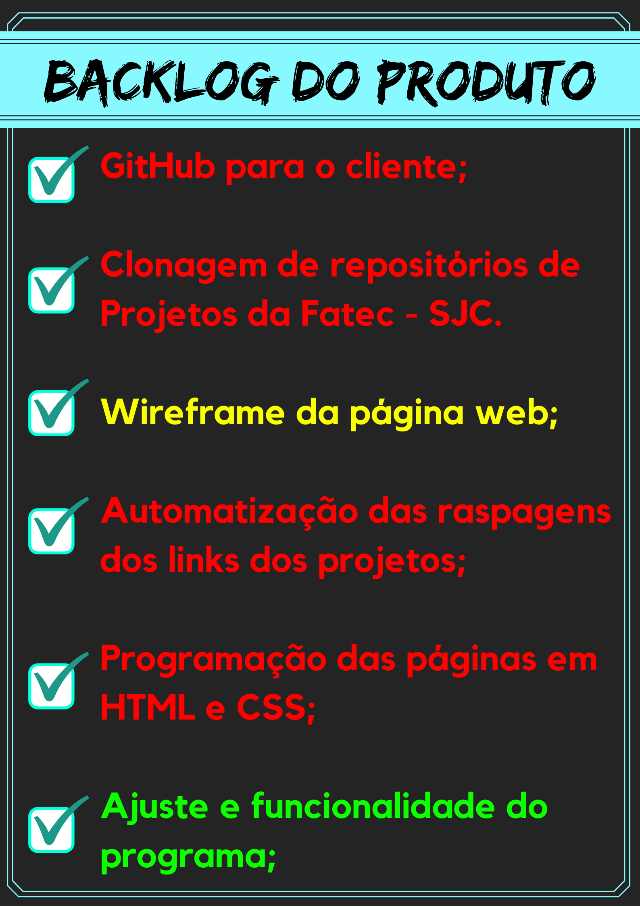

# Aprendizagem por Projetos Integrados

# Objetivo 
Desenvolver um sistema para automatizar o processo de raspagem dos links githubs dos APIs do site Fatec São José dos Campos, visando a disponibilização desses links através de uma página Web.

# Equipe
 - Isabela Silva França de Sousa 
 - Rita Hecht Fernandes Priante 
 - Rodrigo Diniz Goulart 
 - Vitor Landim Blumer
 - Wallace Marinho de Souza Silva 
 - William Claudimar Oliveira da Silva (Scrum Master)

 # Visão do Produto 
 O projeto API é um sistema criado nas linguagens HTML, CSS e Python, com o objetivo de armazenar e gerenciar projetos dos alunos da Fatec — SJC, evitando problemas como a perda ou alteração de arquivos, possibilitando  autonomia e controle total da própria instituição. 

 # Backlog do Produto 

 # Sprints
 

 

 # Cronograma das Sprints
- Sprint 1 - 30/08/2021 a 19/09/2021
- Sprint 2 - 20/09/2021 a 10/10/2021
- Sprint 3 - 18/10/2021 a 07/11/2021
- Sprint 4 - 08/11/2021 a 28/11/2021
- Apresentação Final - 29/11/2021 a 05/12/2021
- Feira de Soluções - 16/12/2021

# Resulado Sprint 1
Resultado de conclusão na entrega sprint 1 temos:

- Wireframe de cada Página:

- GitHub para o cliente e Clonagem dos Projetos da Fatec - SJC:

# Resultado Sprint 2
Resultado de conclusão na entrega sprint 2 temos:

- Página Home:

- Automatização das raspagens dos links dos projetos:

# Resultado Sprint 3
Resultado de conclusão na entrega sprint 3 temos:

* Site programado em HTML e CSS: 

